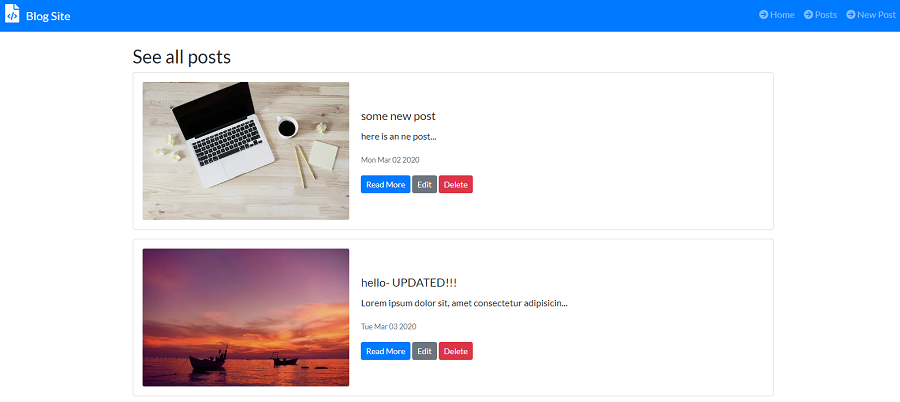

# Node-Blog in Node.js

Node-Blog is a simple CRUD app. It was created for mobile and desktop views. One can add, remove, edit, or show
specific blog. 

## Tools & Technology used

- Visual Studio Code
- Node.js
- Express
- MongoDB
- JavaScript
- Mongoose
- .ejs
- SASS
- body-parser
